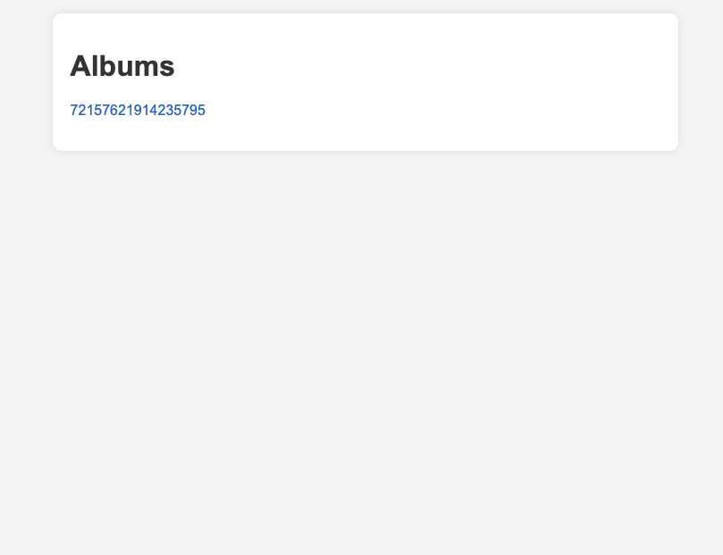
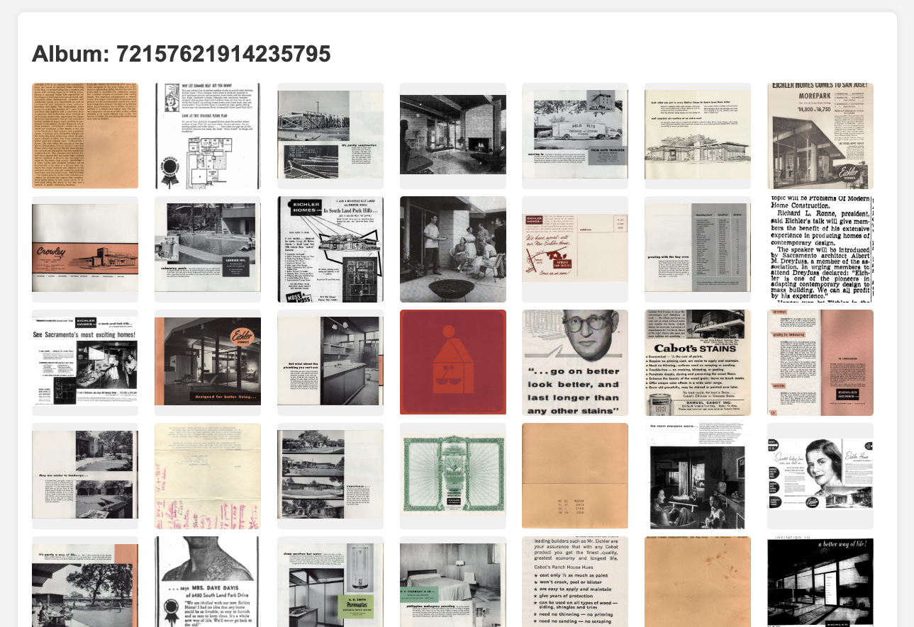
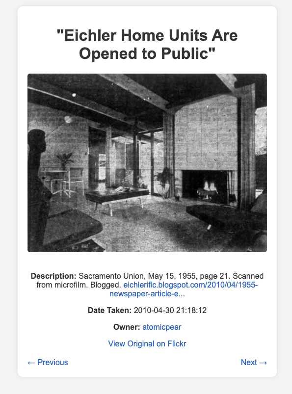

# Flickr Album Downloader

I adapted this project to download albums from Flickr. The platform is full of incredible content, created and shared with care by individuals. But I often wonder: what happens to this content when accounts are abandoned or if Flickr itself disappears? The thought of these works vanishing concerns me deeply. Their archival value is vital for preserving the continuity of the information age.

I recently read an article about the shrinking internet—how independent pages are disappearing, replaced by algorithm-driven platforms and AI-generated content. It made me realize how fragile our digital history has become. The carefully curated works of passionate individuals are at risk of being overshadowed or lost. Preserving these works is essential—not just as history, but as part of the richness of human creativity.

I wanted to preserve an album about the Eichler FC-13 house in Foster City, CA. I really like the design, but finding good content about it—especially images of the interior—was incredibly difficult. [Atomicpear](https://www.flickr.com/photos/atomicpear/albums/72157622598153709/) / [Gretchen](https://eichlerific.blogspot.com/2009/11/my-inner-librarian-wishes-to-share-this.html) published images from a catalog over 13 years ago, doing a wonderful job capturing this architectural gem. I wanted to ensure this album, and others like it, wouldn't be lost to time.

*Please don't use this to redistribute content without permission.*

## To Install
```bash
pip install -r requirements.txt
```

## To Run
Download the album from the album id.
```bash
python album_download.py [album_id]
```
For example, to download the album with the id 72157622598153709:
The corresponding URL is https://www.flickr.com/photos/atomicpear/albums/72157622598153709
```
python album_download.py 72157622598153709
```

## To Serve
The server runs on http://localhost:8000 and list all the albums you downloaded.
```bash
python album_server.py
```

## Demo







*Thanks to Atomicpear for the ispiration and Péter Szabó for the general solution.*
